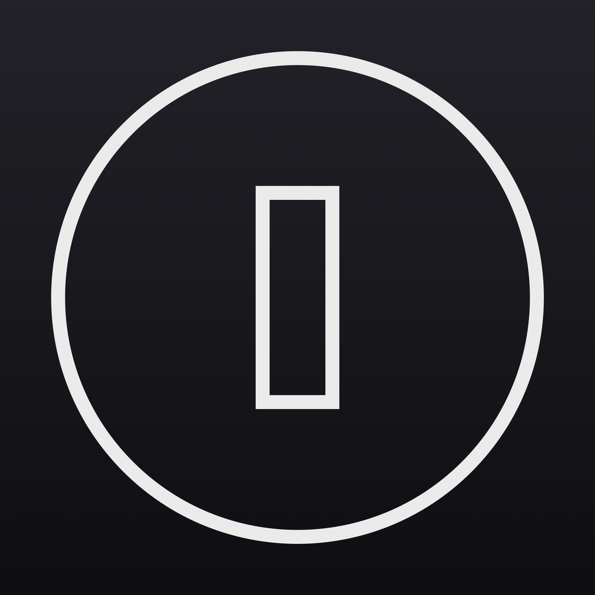

# Maidan

<p align="center">
  
</p>

A lightweight, premium macOS menu bar application that displays live cricket scores in real-time. The app runs completely in the background as a menu bar agent (no Dock icon) named **Maidan**, and is powered by the Highlightly Cricket API.

<p align="center">
  
  
  
</p>

---

## Features

- **Live Ticker**: Displays a short live score directly in the macOS menu bar (e.g., `IND 142/3` or `SL · In play` when scoreless).
- **Live Crease Statistics**: Shows active batters (runs, balls, strike rates) with a custom cricket bat emoji indicating who is on strike, alongside the current bowler's active figures (overs, runs, wickets, economy) updated in real time.
- **Live Win Probability**: An elegant, stacked progress bar displaying the live win percentages for home, draw, and away outcomes (e.g., `IND 69% · Draw 0% · SL 31%`).
- **Venue & Weather Metadata**: Displays the active stadium name, city, and current weather forecast (e.g., `Liberty Stadium, Swansea · ⛅ 12°C`) at the bottom of the dropdown.
- **Projected Scores & Run-Rate Matchups**: Calculates and displays the first-innings projected score (e.g., `Projected: ~178`) for limited-overs matches, alongside side-by-side current run rate (CRR) and required run rate (RRR) visual comparison bars during chases.
- **Today's Matches View**: A scrollable list of today's matches grouped into **Live**, **Finished**, and **Upcoming** sections. Select any match from the list to immediately switch the menu bar and details view.
- **Match Feed Customization**: Select between **All Matches**, **Major Matches Only**, **IPL Only**, or **International Only** filters in the settings panel to keep your feed clean.
- **Rich Local Notifications**: Delivers native macOS system notifications on key events—wickets, boundaries (4s and 6s), innings breaks, close finishes (e.g., when entering the last 3 overs needing under 8 runs per over), and match results.
- **Scorecard Click-Through**: Click on any match title inside the dropdown to instantly open a full scorecard search on Cricbuzz/ESPNcricinfo in your default browser.
- **Keyboard Navigation**: Press Left/Right or Up/Down arrow keys while the dropdown is open to cycle through today's matches instantly.
- **Launch at Login**: Easily toggle launch-at-login from the settings panel so the app starts automatically when your Mac boots.
- **Menu Bar Style Customization**: Choose between **Full**, **Compact**, or **Minimal** styles to control the level of detail displayed in your menu bar.
- **Adaptive & Sleep-Aware Polling**: Intelligently scales polling rates based on match state, backs off when Low Power Mode is active, and pauses completely when your Mac sleeps to conserve API quota and battery.
- **Zero Dock Clutter**: Runs purely in the menu bar as an accessory agent with no Dock presence.

---

## Tech Stack

- **Swift & SwiftUI**: Built natively using modern SwiftUI.
- **`MenuBarExtra`**: Integrates into the macOS system menu bar (requires macOS 14 Sonoma or later).
- **`@Observable` Macro**: Leverages modern state observation (macOS 14+).
- **Standalone Compilation**: Configured to compile directly via `swiftc` or through the Swift Package Manager.

---

## Setup & Installation

### 1. Get an API Key
You can obtain a free API key (100 requests/day) from either of these platforms:
- **Highlightly Direct**: Sign up at [highlightly.net](https://highlightly.net).
- **RapidAPI**: Subscribe to the [Cricket Highlights API](https://rapidapi.com) (allows quick login via GitHub/Google).

### 2. Configure the Project
1. Clone this repository to your local machine.
2. Duplicate the configuration template:
   ```bash
   cp "Sources/Maidan/Config.example.swift" "Sources/Maidan/Config.swift"
   ```
3. Open the newly created `Sources/Maidan/Config.swift` file:
   - Paste your API key into `highlightlyAPIKey`.
   - **If using RapidAPI**: Set `useRapidAPI = true` and ensure `apiBaseURL` is set to `"https://cricket-highlights-api.p.rapidapi.com"`.
   - **If using Highlightly Direct**: Leave `useRapidAPI = false` and ensure `apiBaseURL` is set to `"https://cricket.highlightly.net"`.

*Note: `Config.swift` is already added to `.gitignore` to guarantee your private API key is never accidentally committed to GitHub.*

### 3. Build and Package
You can compile and package the widget into a native, standalone macOS `.app` bundle with a custom high-resolution icon:

```bash
./package.sh
```

Upon successful compilation:
- A double-clickable `Maidan.app` bundle will be created in the root folder.
- Simply double-click the app to launch it natively.
- Drag `Maidan.app` to your `/Applications` folder to install it permanently.

*Note: For quick developer testing, you can still run `./run.sh` to compile and run the executable directly in the terminal background.*

### 4. Stopping the App
To close the application, click the menu bar widget, open the **Settings...** panel, and click **Quit**. You can also close it via standard terminal commands if run via `./run.sh`.
